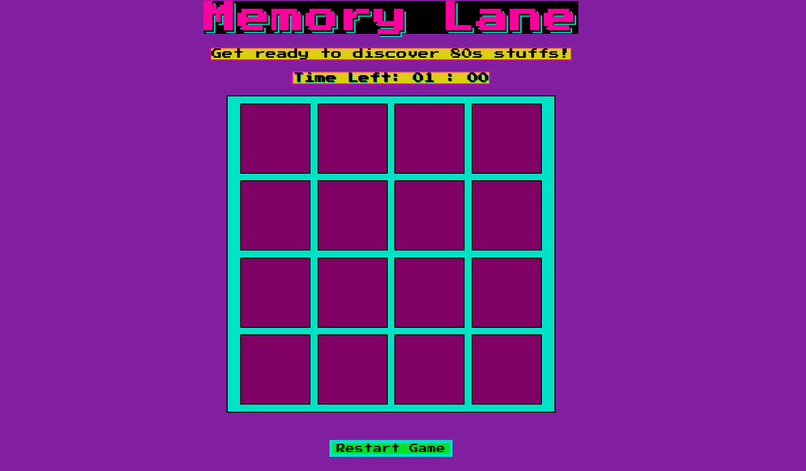

# Memory Lane Game

Simple Memory game 80s style built with HTML, JS and CSS.

## Description
Click on the tiles to discover the image behind. Images are inspired to music icons of the 80s ;) 

When you click, the time will start the countdown: you have 60 seconds to flip all the cards.

## Demo
Find here the link to play from your laptop or smartphone! 
[Memory Lane](https://lu4n4-ru.github.io/memory-game-80s/).

## Layout
Flex and responsive. It's composed of 16 tiles. In this MVP there is no casual image choice, it will be added later on.

## Technical gam tasks 
- Timer countdown
- When click on 2 images a script match the images via their "alt"
- if match is ok, images stay visible
- if match is not ok, cards disappeares after a short timeout (1 sec).
- If the player matches all the cards a window opens to congrats
- if the timer runs out before the player finishes a window open to say the game is over
- a restart button allows to restart the game
- image position is shuffled at each new start
- countdown stops as the player matches all the cards
- if game over, cards are no clickable anymore

